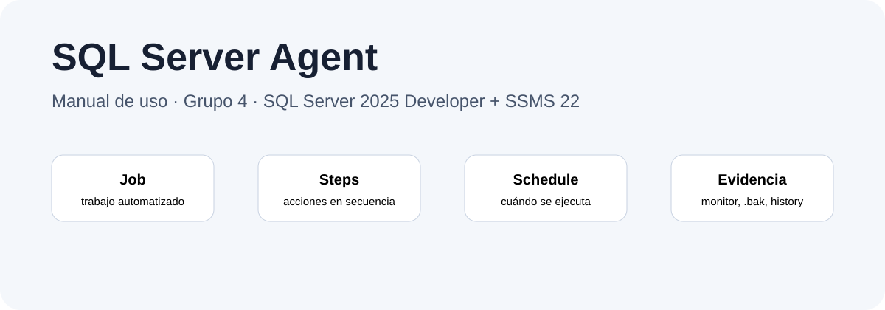
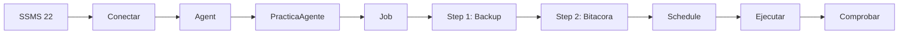

# Inicio

## Objetivo

Explicar, de forma práctica y para principiantes, cómo utilizar **SQL Server Agent** para crear, programar, ejecutar y comprobar un Job automatizado usando:

* Microsoft SQL Server 2025 Developer
* SQL Server Management Studio 22 (SSMS 22)
* Instancia local `localhost\SQLAGENT`
* Base de práctica `PracticaAgente`
* Tabla `dbo.Bitacora`
* Carpeta de respaldo `C:\SQLBackups`

El flujo principal crea un Job que realiza un respaldo de `PracticaAgente` y, si ese respaldo termina correctamente, registra una evidencia en `Bitacora`.

## Flujo general

## Cómo usar este repositorio

1. Leer **Fundamentos**.
2. Seguir **Guía de uso** para conocer cada operación.
3. Ejecutar el **Ejercicio práctico** en el orden indicado.
4. Usar **Solución de problemas** si algo falla.
5. Consultar **Recursos** para glosario, FAQ y referencias.
