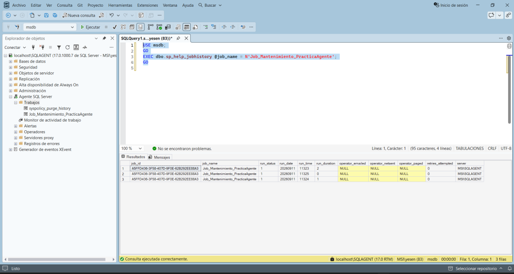
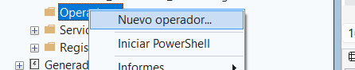

# Consultar Job History

Clic derecho sobre el Job → **View History / Ver Historial**.

El historial permite revisar cada ejecución y cada paso, incluyendo duración, resultado y mensajes.





## Consulta T-SQL

```sql
USE msdb;
GO

EXEC dbo.sp_help_jobhistory
    @job_name = N'Job_Mantenimiento_PracticaAgente';
GO
```

El manual señala que las columnas `run_status`, `run_date`, `run_time` y `message` permiten comprobar el resultado.

Para esta práctica:

`run_status = 1` → éxito.
