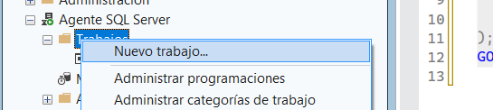
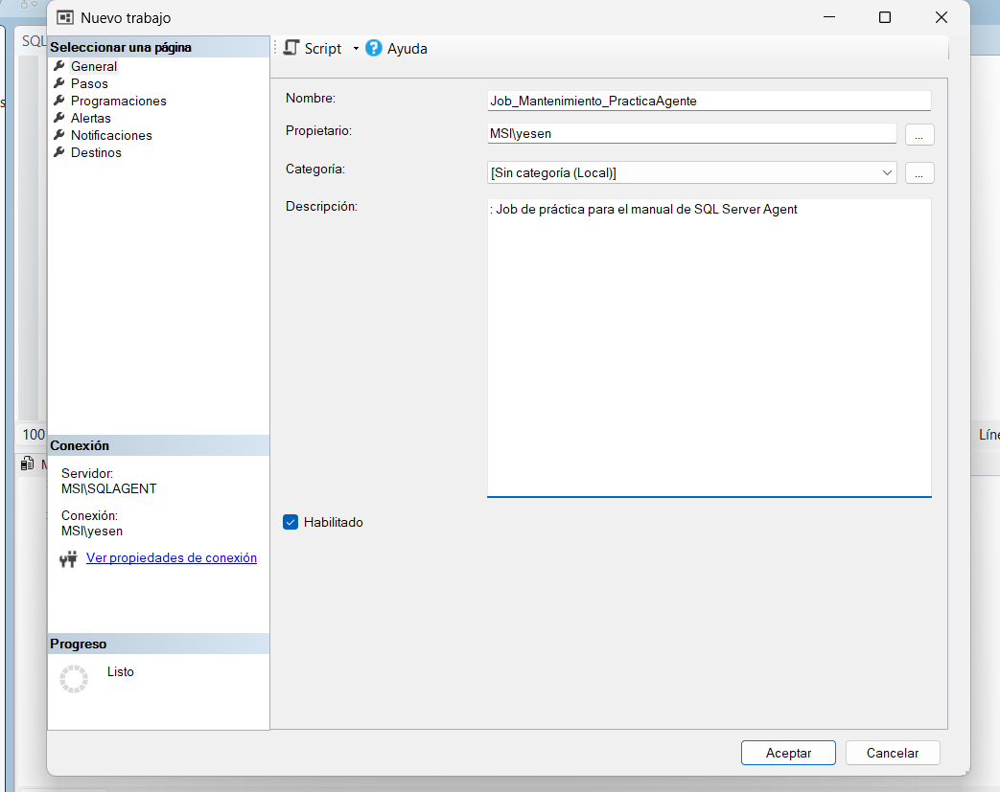

# Crear y administrar el Job

## Crear el Job

En Object Explorer:

**SQL Server Agent → Jobs → clic derecho → New Job...**

Nombre:

`Job_Mantenimiento_PracticaAgente`

Configuración indicada:

* Propietario: valor predeterminado.
* Categoría: `[Uncategorized (Local)]` / `[Sin categoría (Local)]`.
* Descripción: `Job de práctica para el manual de SQL Server Agent — Grupo 4`.
* Habilitado: marcado.

## Administración posterior

Desde **Properties** se pueden modificar los datos generales, pasos y programación.

Para habilitar o deshabilitar:

* Job Activity Monitor, o
* Propiedades del Job → Enable/Disable.

Para eliminar:

**SQL Server Agent → Jobs → clic derecho sobre el Job → Delete**

La eliminación debe hacerse solo cuando ya no sea necesario conservar el Job.
