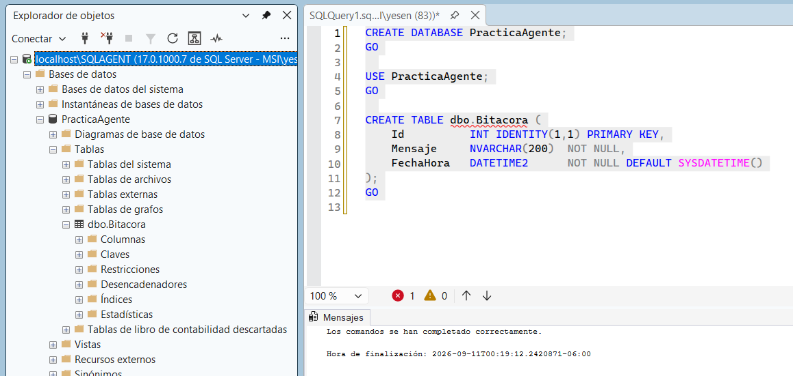
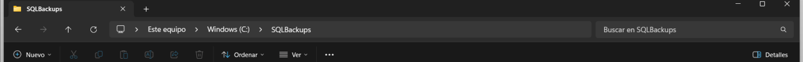

# Crear la base de práctica

La práctica utiliza una base pequeña llamada `PracticaAgente`.

## Crear la base y la tabla

Abrir **New Query** y ejecutar:

```sql
CREATE DATABASE PracticaAgente;
GO

USE PracticaAgente;
GO

CREATE TABLE dbo.Bitacora (
    Id INT IDENTITY (1,1) PRIMARY KEY,
    Mensaje NVARCHAR(200) NOT NULL,
    FechaHora DATETIME2 NOT NULL DEFAULT SYSDATETIME()
);
GO
```

> La representación textual extraída del PDF contiene errores tipográficos en `DATETIME2` y `DEFAULT`; la captura del propio manual muestra la sintaxis correcta anterior.



La tabla `Bitacora` será utilizada para registrar un mensaje cuando el Job complete correctamente el respaldo.

## Crear la carpeta de respaldo

En el Explorador de archivos de Windows, crear:

`C:\SQLBackups`


