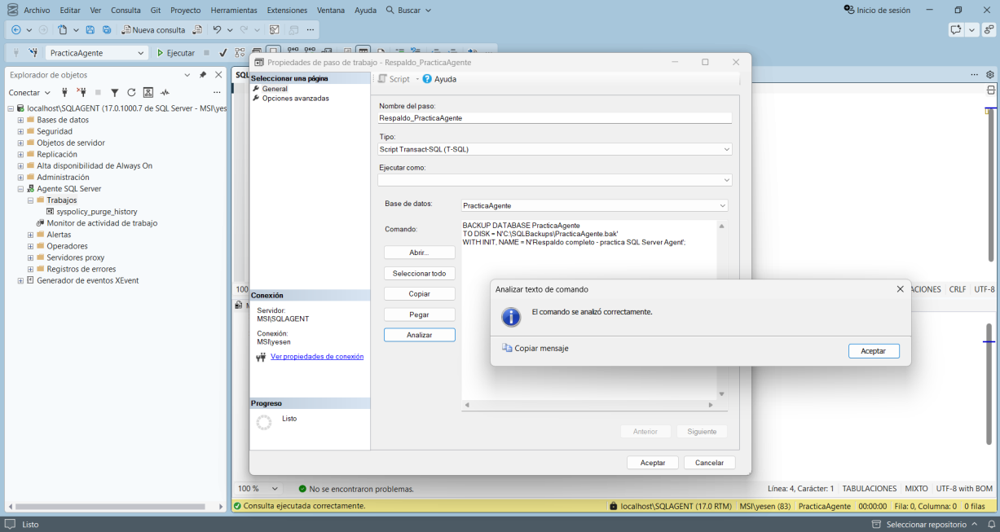
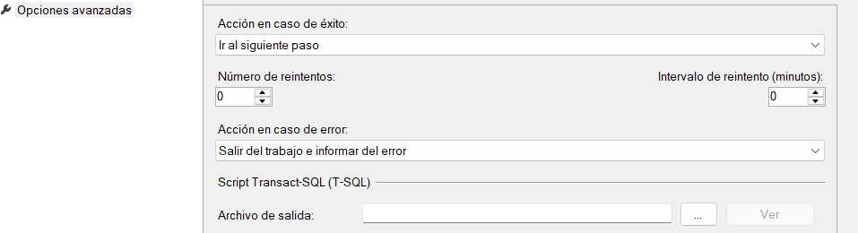
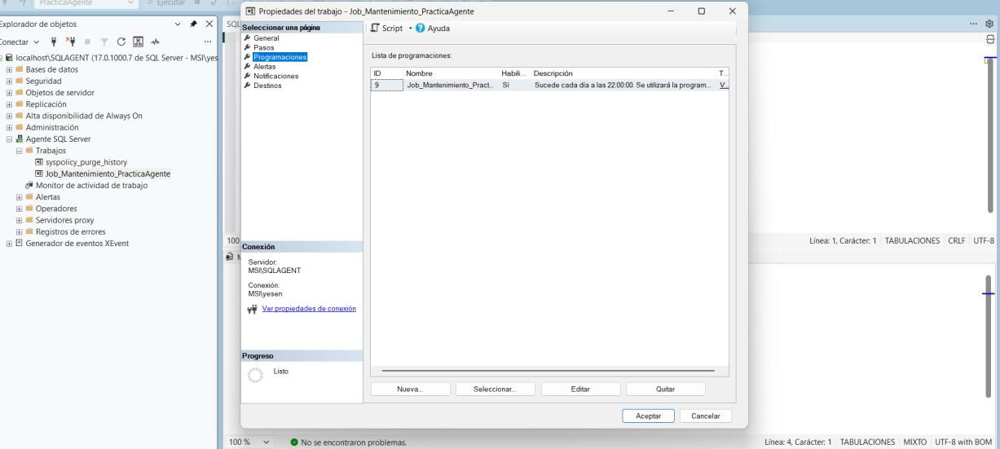

# Crear los Job Steps

## Step 1 — Respaldo de `PracticaAgente`

En la página **Steps**, seleccionar **New...**

* Nombre: `Respaldo_PracticaAgente`
* Tipo: `Transact-SQL script (T-SQL)`
* Base de datos: `PracticaAgente`

```sql
BACKUP DATABASE PracticaAgente
TO DISK = N'C:\SQLBackups\PracticaAgente.bak'
WITH INIT, NAME = N'Respaldo completo - practica SQL Server Agent';
```

El manual indica utilizar **Analizar** para comprobar la sintaxis.



### Opciones avanzadas

* Acción en caso de éxito: **Ir al siguiente paso**.
* Acción en caso de error: **Salir del trabajo e informar el error**.
* Reintentos: `0`.



## Step 2 — Registrar en Bitacora

Crear otro Step:

* Nombre: `Registrar_Bitacora`
* Tipo: `Transact-SQL script (T-SQL)`
* Base de datos: `PracticaAgente`

```sql
INSERT INTO dbo.Bitacora (Mensaje)
VALUES (N'Respaldo ejecutado correctamente por SQL Server Agent');
```

Configurar:

* Éxito: dejar el trabajo reportando éxito.
* Fracaso: dejar el trabajo reportando fracaso.


Resultado esperado: la lista contiene ambos Steps en orden.


