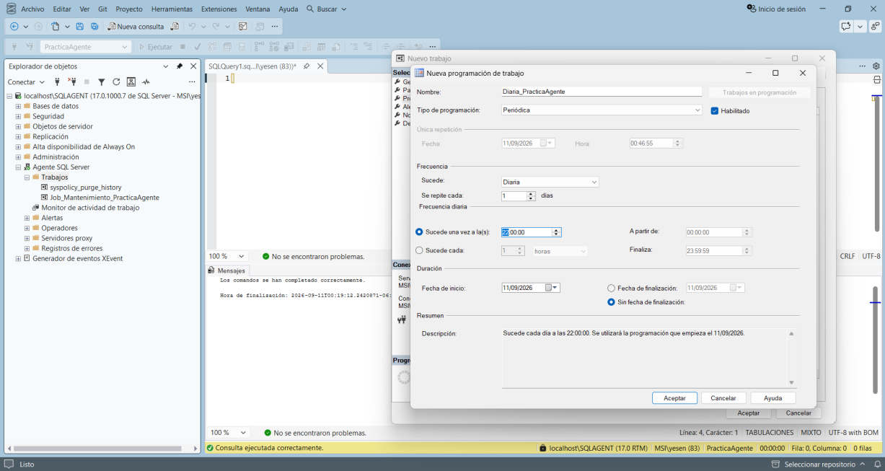
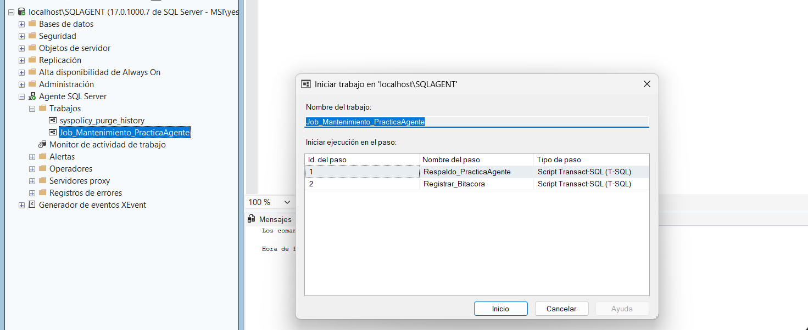
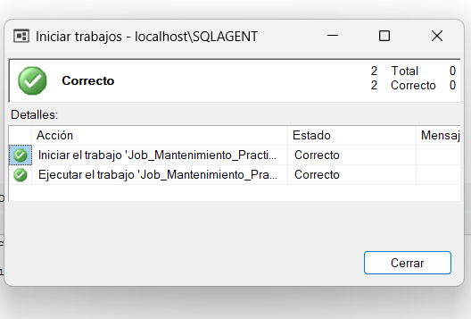

# Crear el Schedule

En el mismo cuadro de **New Job**, ir a **Schedules → New...**

Configuración del manual:

* Nombre: `Diaria_PracticaAgente`
* Tipo: `Periódica`
* Frecuencia: diariamente, cada 1 día.
* Hora: `22:00:00`, o la hora que se prefiera para la demostración.
* Duración: sin fecha de finalización.

Guardar la programación y después guardar el Job completo.

Resultado esperado: `Job_Mantenimiento_PracticaAgente` aparece habilitado y con la programación diaria asignada.

