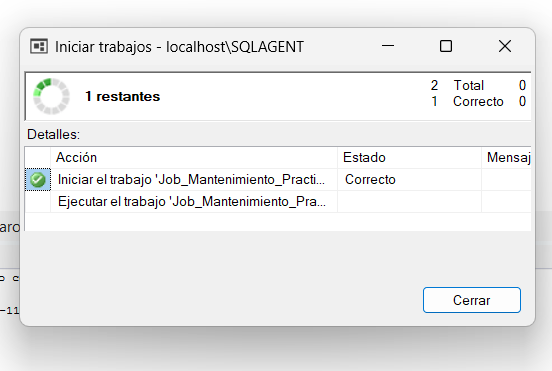
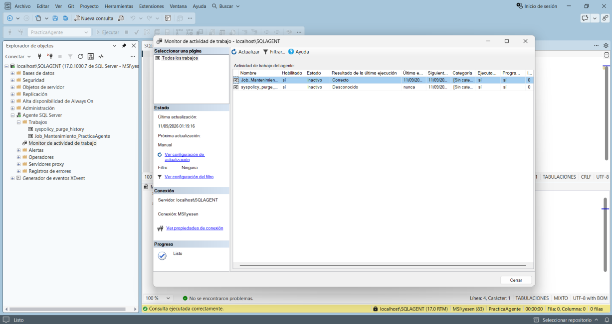

# Ejecutar y detener Jobs

## Ejecutar manualmente

Clic derecho sobre:

`Job_Mantenimiento_PracticaAgente`

Seleccionar:

**Start Job at Step...**

Elegir `Respaldo_PracticaAgente` y presionar **Inicio**.

Resultado esperado: aparece el progreso y finalmente un mensaje **CORRECTO**.

## Detener un Job

Abrir **Job Activity Monitor**, localizar el Job en ejecución, hacer clic derecho y seleccionar **Stop Job**.

Después conviene revisar Job History para determinar el resultado.
