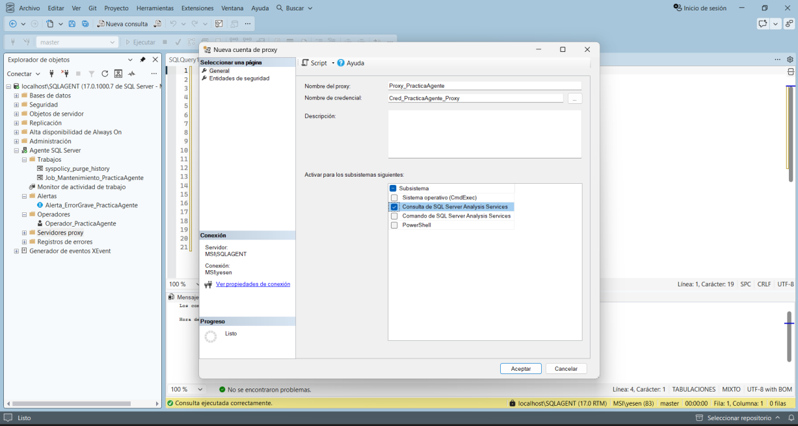

# Error Log

Si el historial del Job no contiene información suficiente, el manual indica revisar el registro de errores de SQL Server Agent.

Ruta:

**Object Explorer → SQL Server Agent → Error Logs → clic derecho sobre Current o un log archivado → View Agent Log**

El Error Log sirve como evidencia adicional para diagnosticar problemas relacionados con el servicio Agent.
