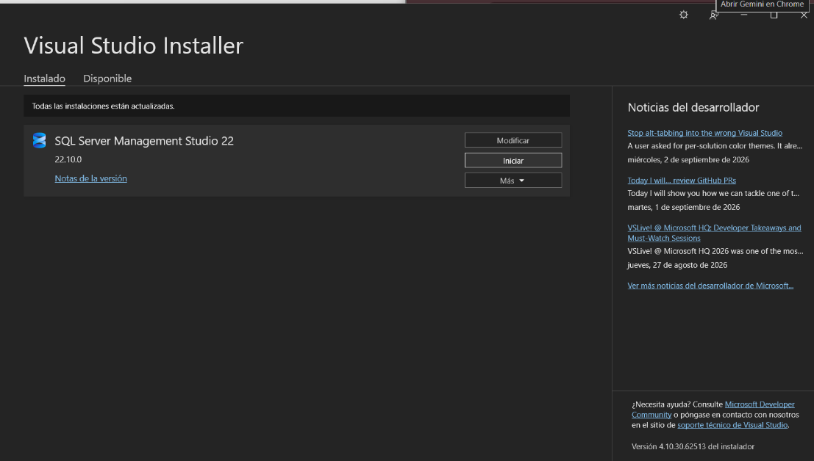
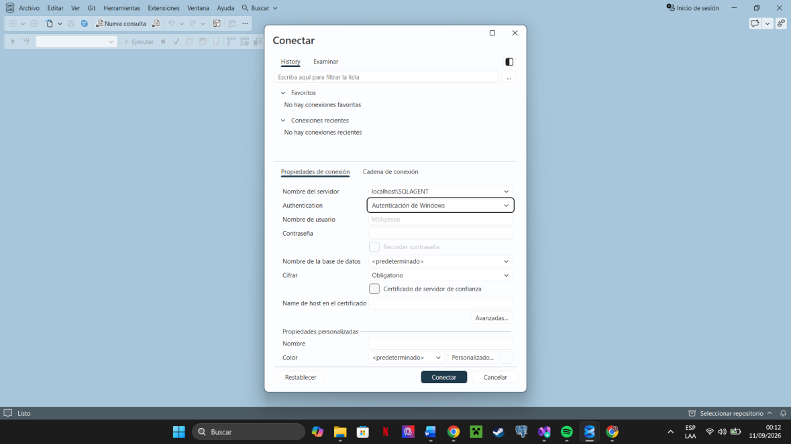
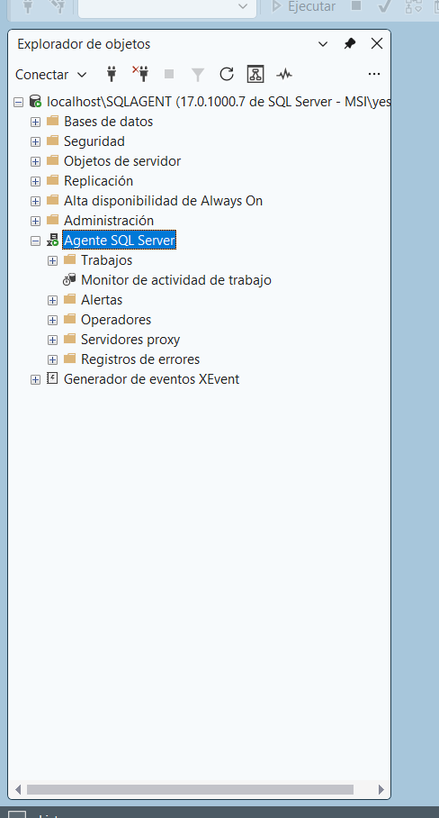
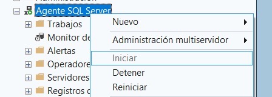

# Iniciar SQL Server Agent

## Paso 1. Abrir SSMS 22

Desde el menú Inicio de Windows, buscar **SQL Server Management Studio 22** y abrirlo.

Resultado esperado: aparece el cuadro de conexión.

## Paso 2. Conectarse al servidor

En el cuadro de conexión:

* **Server name:** `localhost\SQLAGENT`
* **Authentication:** Autenticación de Windows

Después, seleccionar **Conectar**.

Resultado esperado: SSMS muestra la instancia en Object Explorer.

## Paso 3. Ubicar SQL Server Agent

Expandir la instancia y localizar **SQL Server Agent** debajo de las carpetas principales.

## Paso 4. Comprobar que Agent está en ejecución

Un icono con flecha verde indica que está iniciado. Si está detenido, hacer clic derecho sobre **SQL Server Agent** y seleccionar **Iniciar**.

