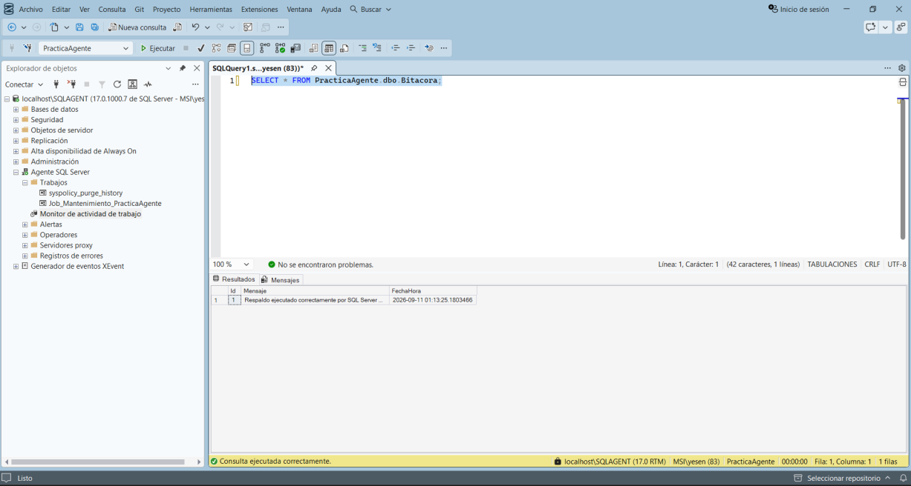
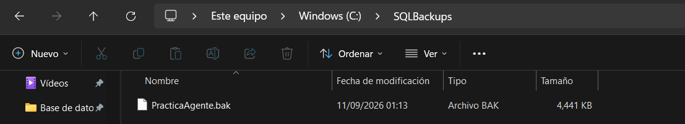
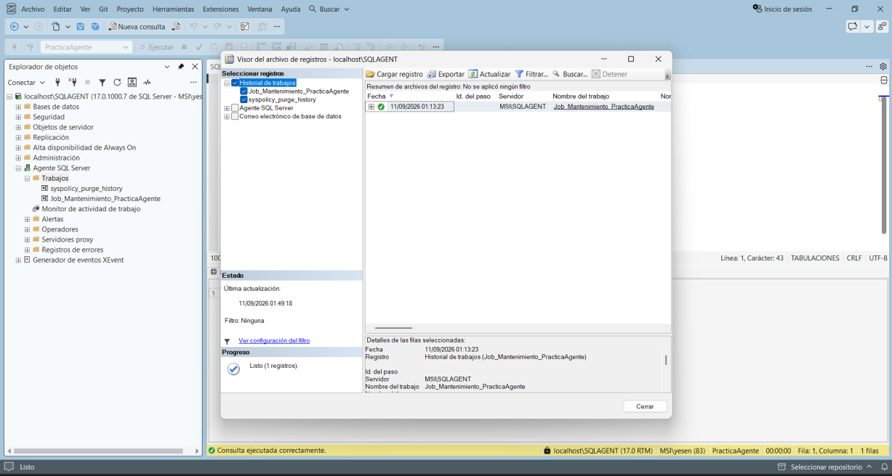
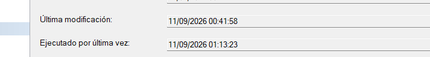

# Comprobar la ejecución

## Opción A — Job Activity Monitor

Dentro de SQL Server Agent, abrir **Job Activity Monitor**.

Buscar `Job_Mantenimiento_PracticaAgente` y comprobar que el resultado de la última ejecución indique **Correcto**.





## Opción B — Bitacora

Ejecutar:

```sql
SELECT * FROM PracticaAgente.dbo.Bitacora;
```

Debe aparecer al menos una fila con el mensaje de éxito y la fecha/hora.



## Opción C — Archivo de respaldo

Comprobar que exista:

`C:\SQLBackups\PracticaAgente.bak`

La fecha de modificación debe coincidir con la ejecución del Job.


