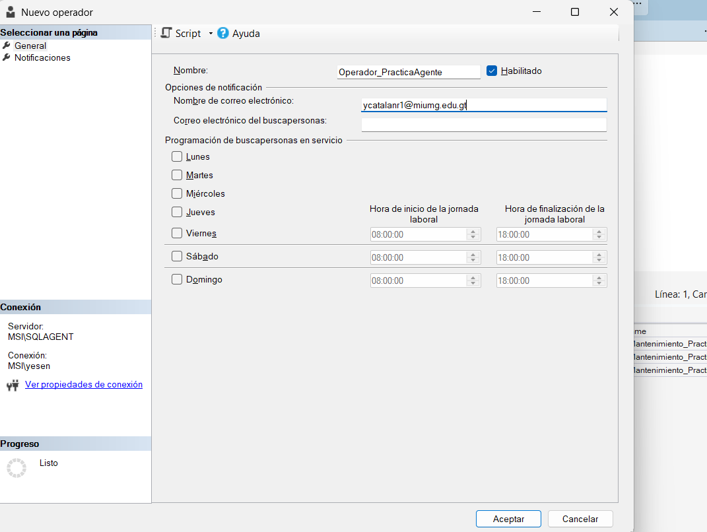
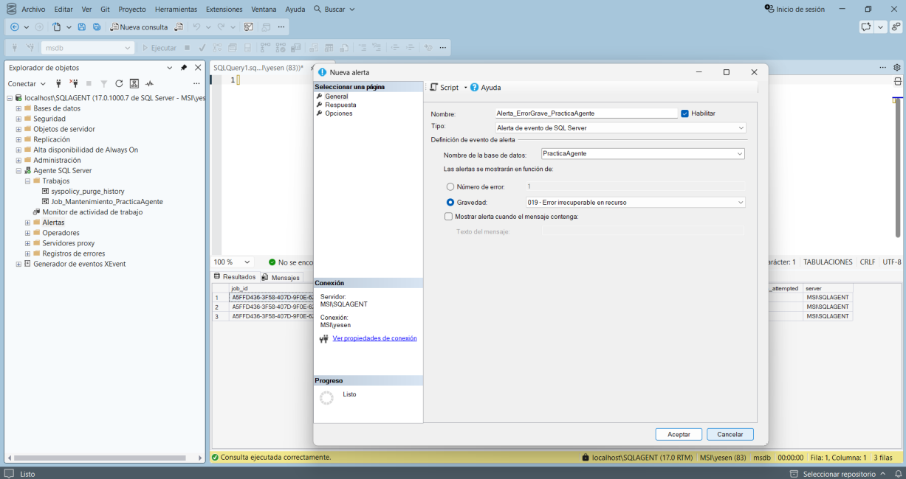
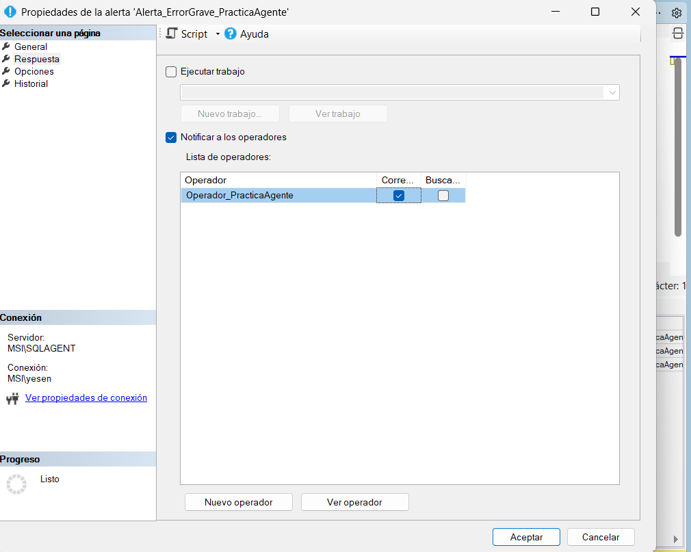

# Operators y Alerts

## Paso 12 — Crear Operator

En SQL Server Agent → **Operators → New Operator...**

Nombre:

`Operador_PracticaAgente`

Indicar una dirección de correo válida y mantener el operador habilitado.

> Para enviar correos reales, el manual requiere Database Mail configurado.

## Paso 13 — Crear Alert

En **Alerts → New Alert...**

* Name: `Alerta_ErrorGrave_PracticaAgente`
* Type: `SQL Server event alert`
* Database name: `PracticaAgente`
* Severity: `019 - Fatal Error in Resource`

En **Response**:

* marcar `Notify operators`;
* seleccionar `E-mail` para `Operador_PracticaAgente`.

Resultado esperado: la Alert aparece en Alerts con el Operator como destinatario.
