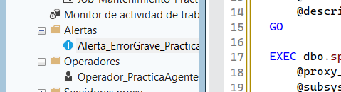
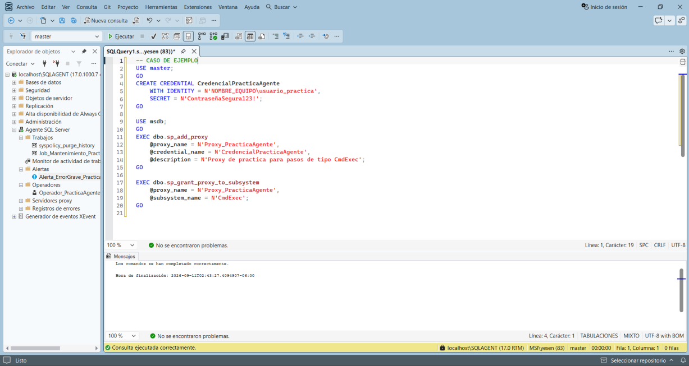
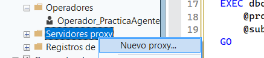

# Crear un Proxy

El manual documenta un Proxy para pasos de tipo **CmdExec**.

## Crear Credential

El ejemplo utiliza una cuenta de Windows real del equipo. No publiques credenciales reales.

```sql
USE master;
GO

CREATE CREDENTIAL CredencialPracticaAgente
  WITH IDENTITY = N'NOMBRE_EQUIPO\usuario_practica',
  SECRET = N'<CONTRASEÑA_NO_PUBLICAR>';
GO
```

## Crear Proxy

```sql
USE msdb;
GO

EXEC dbo.sp_add_proxy
  @proxy_name = N'Proxy_PracticaAgente',
  @credential_name = N'CredencialPracticaAgente',
  @description = N'Proxy de practica para pasos de tipo CmdExec';
GO

EXEC dbo.sp_grant_proxy_to_subsystem
  @proxy_name = N'Proxy_PracticaAgente',
  @subsystem_name = N'CmdExec';
GO
```



También puede configurarse desde Object Explorer → **Proxies → New Proxy**.





> Este Proxy es complementario al ejercicio principal: los dos Steps del Job de práctica son T-SQL.
